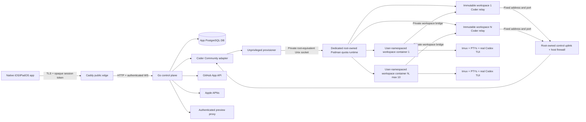

# Architecture

## System shape

Only Caddy/control-plane listener ports are public. PostgreSQL, the exact
RFC1918 Coder listener, the container engine, workspace agents, metrics, and
admin endpoints live on private networks, private Unix sockets, or loopback.
Workspaces do not join the Coder/control network: each Coder agent connects
through a per-workspace relay and an exact host-firewall allow rule. The
workspace engine runs as root only to apply XFS project quotas; its mode-`0660`
`root:coder-provisioner` socket grants root-equivalent authority to the
provisioner and is never mounted into Coder or a workspace. Recovery SSH is
key-only, firewall-restricted, and audited.

## Monorepo boundaries

| Boundary | Responsibility | Must not own |
| --- | --- | --- |
| `apps/ios` | Native navigation, terminal rendering/input and target-labeled composer, passkey ceremony, Keychain, encrypted read-only cache/drafts/history, Git/editor/preview UI | GitHub App/Coder admin tokens, direct workspace access, business policy, persistent attachment bytes |
| `services/control-plane` | Public API, sessions, provider orchestration, policy, audit, terminal/preview gateways, APNs, vault | UI rendering, provider-specific types outside adapters |
| `packages/api-contract` | OpenAPI, generated Swift types, binary terminal protocol | Runtime secrets or environment-specific URLs |
| `infra` | Single-host hardening, private networking, pinned deployment, Coder template | Automatic VPS creation or scaling |

## Control-plane packages

- `auth`: WebAuthn ceremony, one-time bootstrap, opaque access/rotating refresh credentials, device revocation.
- `githubapp`: installation verification, short-lived installation token broker, repository/clone/push/PR operations.
- `workspace`: lifecycle state machine, `WorkspaceProvider`, durable provider
  ambiguity phases, exact-running start boundary, devcontainer trust, and unique
  branch/worktree policy.
- `admission`: equal CPU/memory fair shares, immutable 8–16 GiB disk requests,
  ten-running cap, 40 GiB host reserve, worst-case start guard, continuous
  admission-to-runtime reservation, conservative quota high-water persistence,
  and level-triggered repair.
- `terminal`: tmux-backed PTYs, mandatory pre-sequence active-grant redaction,
  versioned binary frames, bounded replay/admission/subscriber queues, targeted
  idempotent-input receipts, acknowledgement/backpressure, one-writer lease,
  and revocation gates around every PTY mutation and WebSocket write.
- `attachments` and `attachmentjanitor`: content-signature/limit policy, randomized root-confined staging on the workspace's dedicated no-exec tmpfs, and bounded periodic expiry.
- `workspacehelper`: fixed trusted filesystem/Git/checkpoint/credential/attachment operations inside the workspace boundary; it never dispatches a user-assembled shell command.
- `codexevents`: authoritative TUI launch/resume and optional version-pinned app-server structured events.
- `files` and `gitops`: production-Linux fd-relative no-follow file/search/save with exact displaced-content ETag CAS, portable confined development backend, serialized native Git actions, and trusted in-process `go-git` authentication for remote operations.
- `preview`: detected-port registry, audience-bound tokens, authenticated HTTP/WS proxy.
- `vault`: envelope encryption, grant metadata, injection/redaction boundaries.
- `notify`: generic direct-APNs events and authenticated deep-link metadata.
- `operations`: checkpoints, maintenance, audit, local metrics, diagnostics, retention.

## Core flows

### Workspace creation

1. Authenticated owner selects a repository installation and base branch.
2. Admission computes equal CPU/memory shares using running-count + 1, records
   an immutable 8–16 GiB disk request (12 GiB default), and either reserves
   capacity or queues. A new start requires the 40 GiB host reserve plus a
   worst-case 16 GiB workspace, regardless of the smaller requested quota. An
   admitted start holds admission continuously through acquisition of the
   provider-runtime gate, and its durable `provider_start_reserved` phase proves
   that no provider call has happened yet.
3. Backend creates a unique `codex-mobile/<slug>-<short-id>` branch/worktree identity.
   Creation-time environment values and the optional initial prompt are never
   persisted in the workspace row. A `private_inputs_pending` marker is cleared
   only after every value is encrypted and committed. A crash, partial write, or
   legacy ambiguous persistence code leaves the row failed with
   `private_inputs_recreate_required`; retry cannot guess which values survived,
   so the owner must delete and recreate the workspace.
4. Before the first provider call, the reservation changes to
   `provider_provision_unconfirmed`. The unprivileged provisioner asks the
   private root-owned engine to create a
   one-time XFS project-quota volume, then provisions a user-namespaced,
   non-root, non-privileged workspace without engine socket, host path, device,
   or cross-workspace mounts. The same build creates an immutable non-root relay
   between that workspace's private bridge and the fixed control uplink; the
   workspace itself never joins the uplink. Deterministic provider lookup and a
   stop-before-release cleanup path resolve response-loss ambiguity.
5. Repository-controlled setup pauses at `awaiting_setup_approval` on first run.
   A shared reconciler atomically ensures one non-expiring pending safety event
   and linked activity for direct creation, retries and queued promotion. A
   decision becomes resolved only after workspace acceptance/denial is durable,
   so retry cannot strand the workspace between event and provider state. See
   [ADR 0019](docs/adr/0019-durable-setup-review-reconciliation.md).
6. Coder's asynchronous start is not treated as ready on request acceptance.
   The adapter waits for the exact accepted or response-loss-recovered start
   build to remain latest and reach `running`; failure, cancellation, timeout,
   an unknown state, or a superseding build fails closed. Only then does a named
   tmux session start, with its primary window launching the real Codex TUI.

Start, stop, delete, and quota builds share one provider-runtime mutation order.
Before a new runtime can become live, existing stable runtimes are reduced to
their N+1 share. Quota persistence records the component-wise maximum of the
current and target CPU, memory, and disk before the exact provider build, then
records the exact target after that build reaches `running`. Ambiguous
transitional workspaces block another start or expansion. Immediate rebalances
are best effort; every lifecycle scan retries per-owner convergence from durable
rows, including after restart. See
[ADR 0020](docs/adr/0020-durable-provider-capacity-reconciliation.md).

### Workspace autonomy transition

1. The owner suspends the workspace; Coder must confirm the stop build before
   the control plane persists `suspended` and exposes the stopped boundary.
2. `update_autonomy` is owner-scoped, state-guarded, and serialized against
   resume. Every other lifecycle state returns a conflict without mutation.
3. Resume sends the stored mode as Coder's mutable egress parameter. The
   trusted initializer rewrites managed Codex configuration with the same
   mode, and only then may the workspace return to `running` and expose
   terminals or previews. See
   [ADR 0013](docs/adr/0013-suspended-workspace-autonomy-transition.md).

### Workspace suspension and deletion

Suspension first persists `suspending`, then enters an injected application
boundary that takes the same workspace mutation gate as terminal and preview
creation. It unregisters every tab (draining tickets, reconnect credentials,
subscriber mutations and WebSocket writes), clears the running cache, revokes
preview grants/routes and cancels tunnels. The gate remains held until Coder
confirms stop and `suspended` is saved. Cleanup, provider-confirmation and final
save failures leave `suspending` for idempotent lifecycle retry; resume therefore
opens a fresh PTY. Manual, idle and maintenance suspension share this path. See
[ADR 0018](docs/adr/0018-suspension-runtime-authority-boundary.md).

Deletion first persists `deleting`, waits for Coder to confirm provider absence,
then takes the same application boundary while terminal/preview authority is
drained. Only afterward does one owner/state-guarded transaction delete the
workspace row and cascade operational children. Audit rows survive with a NULL
workspace link and immutable target ID. Provider, cleanup and persistence
failures retain the tombstone for lifecycle retry. HTTP success is synchronous
200; the acknowledgement snapshot says deleting only because the API schema has
no deleted resource representation. See
[ADR 0017](docs/adr/0017-workspace-deletion-finalization.md).

### Workspace Coder control path

1. The host creates and validates a fixed `codex-mobile-control` rootful-Podman
   bridge on a narrow RFC1918 subnet that is disjoint from the configured Coder
   listener address. Production Coder binds only that literal private address
   and port.
2. Every running workspace and its immutable `cm-relay-<workspace>` container
   share one private internal bridge. The workspace resolves
   `cm-coder-control:7080`; the non-root, read-only relay forwards only TCP to
   the operator-pinned Coder listener. It receives no token, volume, host path,
   device, capability or engine socket.
3. Only the relay joins `codex-mobile-control`. Host `INPUT` and `DOCKER-USER`
   rules allow that interface and source subnet to reach the exact Coder
   address/port and drop every other route. Balanced and Full Access use a
   separate per-workspace egress bridge; Safe Mode has no such bridge.
4. The Coder agent token remains in the workspace and is scoped by Coder with
   `api_key_scope = "no_user_data"`. The relay narrows network reachability; it
   is not a credential boundary, protocol authenticator or VM boundary.
   Repository code runs with the same workspace authority and may be able to
   observe or use that standard agent bootstrap token. The privileged Coder API
   token used by the control plane and the provisioner key/private Podman socket
   never enter the workspace or relay.

Static Terraform, preflight, network-validator and firewall tests prove the
declared policy only. `CODER_WORKSPACE_CONNECTIVITY_CONFIRMED` must stay `false`
until the target Ubuntu spike proves the rootful-Podman route, Safe Mode denial
of all other host/general egress, Coder agent registration and real PTY control.
See [ADR 0014](docs/adr/0014-workspace-coder-control-relay.md).

### Terminal reconnect

1. Client opens an authenticated control-plane WebSocket and supplies workspace/tab plus last acknowledged sequence.
2. Gateway checks authorization and returns bounded replay from the server ring.
3. If the cursor is truncated or ahead of a restarted replay generation, the
   gateway sends a nonzero gap marker followed by the complete retained window.
   The client clears renderer and encrypted terminal cache, resumes from the
   announced earliest sequence, and rebuilds from that window.
4. A rejected stale reconnect token is discarded once and retried through the
   still-authenticated owner session; successful descriptors rotate the token.
5. PTY continues independently of the socket. Only the active lease holder may
   send input; resize remains tab-scoped. Composer sends use a nonzero
   per-delivery idempotency key and are complete only after a reliable receipt
   targeted to that WebSocket after the PTY write. A retry reuses the same key.

Ticket issuance is linearized with session and device revocation per
owner/device: after any slow workspace/runtime setup, the request acquires a
reference-counted gate, revalidates the durable principal, and only then mints.
Revocation holds the same gate through its durable mutation and terminal sweep.
Ticket consumption and subscriber installation are one manager-lock operation,
so a concurrent sweep sees either the unused ticket or the installed subscriber.
Refresh rotation uses the gate too; refresh replay commits family revocation and
sweeps the affected device's terminal and preview access before releasing it.
Each installed subscriber also owns mutation and delivery gates. Revocation
marks both before disconnect and waits outside manager/tab locks for any earlier
PTY mutation and underlying WebSocket write to finish, so no queued replay,
receipt, output or attention write can begin after return. Gate entries are
reference-counted and deleted after the final holder/waiter. See
[ADR 0016](docs/adr/0016-revocation-linearization.md).

Receipt/dedupe state is bounded and held by the gateway process, not durably
stored. It prevents duplicates across a lost connection while that replay
generation lives, but cannot close the crash window where the PTY write
succeeds and the gateway dies before returning the receipt. Applied records are
bounded to 2,048 per device and 4,096 per tab; at capacity, new idempotent input
is rejected before a write until confirmations free records or the tab
generation resets.

### Native composer and attachments

1. The composer is bound to the currently displayed workspace and terminal tab. Its multiline text and sent-message history are encrypted at rest with a target-scoped AES-GCM record and a this-device-only Keychain key; system dictation remains the normal iOS keyboard facility.
2. Photos and security-scoped regular files are signature-checked and read through hard count, per-file, and aggregate bounds. Their bytes remain in native memory and original filenames are never sent to the service or offline cache.
3. Explicit Send first authenticates and stages any attachments through the owner/workspace/tab-scoped control-plane operation. The trusted workspace helper creates random mode-`0600` files beneath a mode-`0700` directory on `/codex-mobile-attachments`, a dedicated `nosuid,nodev,noexec` tmpfs outside the repository and persistent workspace data.
4. The app inserts only the returned temporary paths and media types into
   bracketed-paste input for the authoritative PTY, then sends Return with one
   retained idempotency key. A missing receipt retains the encrypted draft and
   current volatile selections for a same-key retry; only the targeted server
   receipt clears the draft into bounded history and wipes the selections.
   Pending delivery keys are in memory: terminating the app after server
   confirmation but before draft clearing can leave a stale resendable draft.
   Attachment retries reuse the exact staged payload until its expiry; an
   expired staging set requires a new delivery.
5. Staged files carry a 30-minute expiry. Each stage performs opportunistic cleanup, the control plane periodically asks active runtimes to remove expired batches, and suspend/restart destroys the tmpfs. Audits contain only attachment count and total bytes. See ADR 0009.

### Authentication

The first owner uses a console-generated, short-lived, single-use bootstrap token to register a passkey. WebAuthn challenges are server-side, single-use, five-minute, RP/origin-bound records. An authenticated owner can add another passkey only from the current active installation using the same this-device-only binding; existing credentials are excluded. Passkey lists expose metadata only, revocation is owner-scoped and idempotent, and registration/revocation serialize so the final credential cannot be removed. Successful authentication issues a short opaque access credential and rotating opaque refresh credential; only keyed hashes are stored. Refresh replay revokes the whole family and audits the event.

Ceremony admission does not trust client IP or forwarded headers. The 4,096-record store permits at most 3,840 login ceremonies, preserving 256 slots for bootstrap-token and authenticated registration. Unknown installations are additionally capped at 512 active logins and share a 32-request burst with one refill per second. Historical 256-bit device-instance hashes are loaded through a 4,096-entry bounded cache, including revoked devices that may present a valid passkey again, and receive an independent 32-request/four-per-second lane. Every instance gets one active replace-on-retry ceremony, a four-request burst and one refill per 15 seconds. The rate-state map is capped at 4,608 and prunes after refill/expiry; all limiter paths return the same generic capacity problem. See [ADR 0015](docs/adr/0015-bounded-passkey-admission.md).

### Codex integration

Codex uses a dedicated `CODEX_HOME` outside the repository with `forced_login_method = "chatgpt"` and the explicit file credential store. The trusted helper volume bundles the pinned real binary and wraps every normal launch. A per-workspace 32-byte key is envelope-encrypted in PostgreSQL, installed only on container tmpfs during trusted configure, and used to materialize `auth.json` on tmpfs while a Codex process is active. The last concurrent wrapper exit and every checkpoint boundary authenticate-encrypt the file outside the repository; resume reruns the idempotent initializer because container stop clears tmpfs. Configured runtime environment plaintext follows the same tmpfs lifecycle. See ADR 0007 for residual same-authority risk. Device auth is an owner-completed beta flow. The stable terminal TUI and `codex resume` remain authoritative. Structured app-server events are local-only, version-pinned, capability-gated, and optional; generic TUI attention notifications remain the fallback.

### Connection status and disconnect

The owner-authenticated `GET /v1/connections` view separates server GitHub-App
configuration from the owner's active installation records and reports ChatGPT
Codex authentication independently for each workspace. A suspended or otherwise
unavailable runtime is reported as unavailable; status does not infer account
identity from terminal output or expose credential material.

GitHub disconnect is a local, owner-scoped and idempotent revocation. It marks
that installation disconnected, hides its repositories and blocks token minting
before any GitHub API call, including trusted workspace initialization. It does
not call GitHub, uninstall the App or revoke provider-side installation access.
Only an explicit owner-run synchronization reconnects local authority; webhooks
cannot silently undo the disconnect.

Every installation-token mint and its complete use holds a shared,
owner/installation-scoped PostgreSQL advisory lease. Disconnect, explicit
reconnect, provider suspension, ordinary repository sync and signed provider
unsuspend take the exclusive form. A sync acquires it before fetching fresh
installation metadata and retains it through metadata persistence, active-state
validation, token mint/list and final repository writes. Ordinary refresh cannot
clear provider suspension or owner disconnect. Signed unsuspend has no separate
resume gap: it may clear only provider suspension, only after the in-lease fresh
provider response is active, and never clears owner disconnect. Disconnect first
drains prior operations, commits `owner_disconnected_at` plus repository
unavailability while exclusive, and returns only after no later mint/use can
have crossed that boundary. Dedicated sessions release the lease on process
failure. Dedicated shared-lease concurrency is capped at
`min(max(1, MaxConns), 8)` and exclusive concurrency at
`min(max(1, MaxConns), 2)`; callbacks retain the ordinary pool even when
`MaxConns=1`. See
[ADR 0016](docs/adr/0016-revocation-linearization.md).

ChatGPT Codex disconnect is per workspace, requires explicit confirmation and a
running/available workspace, and serializes with workspace mutation. The control
plane first validates every stored Codex tab identity. The helper then kills
only their fixed app-owned `cm-<tab-id>` tmux sessions, waits for their credential
leases, and removes materialized tmpfs auth, the tmpfs key and the persistent
encrypted auth envelope. That helper confirmation is the security commit point;
only afterward does the control plane clear/unregister its terminal runtimes.
If that later bookkeeping cleanup fails, the request returns and audits a
runtime-cleanup error with credentials already revoked rather than restoring
them. Shell/other tmux processes and Codex conversation session history remain.
Reconnection requires the owner to resume the workspace as needed and complete
`codex login --device-auth` again in the genuine TUI.

### Runtime secrets and key rotation

Only active, explicit owner/workspace grants are decrypted by the control plane.
The initializer transfers bounded mutable byte buffers through the trusted
configure request, wipes both the values and serialized request, and the helper
stores the grant set only as a mode-`0600` file in its private tmpfs runtime
directory. Grant and revoke operations serialize per workspace, commit the
database mutation, then synchronize a freshly loaded authoritative grant set
to that tmpfs. A partial runtime-sync failure is returned and audited honestly;
every new terminal launch repeats the sync and fails closed if it cannot.
Terminal launch merges those values in memory; checkpoint/suspend sealing
removes the materialized grant set, and resume must configure it again. An
already-running process keeps the environment it inherited until the owner
closes that process.

Before a PTY is registered, the same authoritative values build a mandatory
stateful output redactor. Exact, hex, base64/base64url, URL-escaped, and wrapped
forms are matched across PTY chunks before bytes enter the sequence ring,
subscribers, or native cache. Unsupported secret bounds fail terminal start.
The iOS cache adds a conservative heuristic filter, but neither layer claims to
recognize unrelated sensitive output that is not a known value/form.

Native stage, commit, pull, and push construct an ephemeral scanner from the
current grant values. It blocks raw, hex, base64, base64url, and common URL
forms, ignores values too short for safe matching, applies hard pattern/file
limits, and reports no matching name or value.

Authenticated bootstrap, pull, push and remote-reference listing obtain a
bounded repository-scoped installation token from the credential broker and
use it only as in-process `go-git` HTTPS BasicAuth. The trusted transport accepts
an exact GitHub HTTPS URL, bypasses attacker-controlled proxies and uses the
root-owned helper CA bundle. Cleanup clears the mutable input buffer and auth
field and releases the broker credential. No AskPass/credential/token file,
environment variable, argv value or token-bearing remote URL is created. The
token still exists transiently in trusted process memory; arbitrary terminal
Git subprocesses are not given a service credential.

All workspace shell, direct Codex, and helper Git launches use fixed
executables/argv plus explicit inherited-environment allowlists. Owner-defined
environment values and active grants are added through the trusted boundary;
Coder, database/control-plane, GitHub/APNs, shell-hook, and unknown ambient
variables are not inherited.

### File reads and saves

The production Linux helper pins the workspace root and resolves every parent
with fd-relative directory opens and `O_NOFOLLOW`; final targets must be regular
files. Create is atomic and no-replace. Update stages and fsyncs a sibling,
atomically exchanges names, then hashes the exact displaced file and rolls back
if it does not match the expected ETag. A save error after a namespace change
can mean the commit happened but cleanup/durability confirmation failed, so the
client must fresh-read and reconcile the ETag before any retry.

The portable development backend uses `os.Root`, stable opens, and repeated
ETag checks, but platforms without rename-exchange cannot provide the same
external-writer CAS guarantee in the last check-to-rename interval. Production
therefore requires the Linux backend and its target-filesystem race tests. See
[ADR 0011](docs/adr/0011-linux-file-confinement-and-exact-etag-cas.md).

### Host storage and workspace disk quotas

Operator-managed encrypted storage is mounted exactly at `/srv/codex-mobile`
as XFS with `pquota` or `prjquota`. Ansible, deploy preflight, and the dedicated
Podman unit fail closed otherwise. Each workspace volume is created once with
`size=<G>G` and `inodes=<G*65536>` local-volume options and is not resized by
later equal-share changes. Ten maximum 16 GiB volumes consume 160 GiB of the
200 GiB budget, leaving 40 GiB for the host; admission requires at least 56 GiB
free before every new start. Static checks do not prove kernel enforcement: a
target Ubuntu spike must demonstrate an over-quota write fails.

The administrator also records the exact `findmnt` source for this mount as
`WORKSPACE_IO_DEVICE`; Ansible, preflight, template import, and runtime startup
all reject a mismatch instead of guessing a host block device. The template
sets fixed per-container BPS/IOPS maxima on that device and caps EnvBuilder's
writable overlay at 4 GiB. Plain workspace root filesystems remain read-only.
The pinned Docker provider does not expose `PidsLimit`, so the dedicated Podman
engine applies a fixed 512-process default at container creation. Production
acceptance requires a live template-created container to show the same value
in HostConfig and cgroup-v2 `pids.max`, plus the configured limits in `io.max`.
See [ADR 0010](docs/adr/0010-xfs-workspace-quotas-and-private-podman-runtime.md).

Serving processes hold a shared PostgreSQL advisory lease. The offline
master-key command requires the exclusive lease and uses one serializable
transaction to authenticate, rewrap, and new-key-verify every versioned
passkey, encrypted-secret, and APNs envelope before applying any update. Unknown
AAD families abort rather than being skipped. The operator owns the atomic key
file switch and matching database-checkpoint rollback. See ADR 0008.

### Backup and master-key recovery boundary

The wrapping master is a root-owned host file, separate from PostgreSQL and
database-only exports. The contracted provider product takes a whole-server
backup, so a normal capture is expected to contain both encrypted database/data
and that file. This makes a consistent provider restore available without
silently mixing a database with the wrong key, but it does not protect encrypted
values from a provider administrator or attacker who obtains the full backup.

The owner also keeps a matching offline key copy for loss/corruption recovery.
That is an independent availability copy, not evidence that the provider backup
lacks the key. A host or full-backup compromise is therefore handled as
master-key compromise: rotate or re-enter upstream/runtime values rather than
claiming envelope encryption kept them confidential.

## Data model

Every mutable core record contains `owner_id`, even though the MVP has one owner. IDs are random UUID/ULID-like opaque values. The schema covers owner, passkey, device, session/token family, GitHub installation/repository, workspace/build/quota/retention, terminal tab/replay, Codex mapping/attention, approval, preview, secret/grant, notification, checkpoint, maintenance, and append-only audit events. Workspace rows additionally retain non-secret crash-recovery markers for private-input persistence and provider start phases; creation-time private values themselves are stored only in their encrypted destinations.

## Failure philosophy

- External provider failures are explicit state-machine transitions, never silent partial success.
- Local GitHub disconnect does not claim to uninstall the provider-side App;
  per-workspace Codex disconnect does not claim to revoke the owner's upstream
  ChatGPT account/session.
- Cleanup is idempotent.
- Ambiguous workspace stop/delete failures retain durable `suspending` or
  `deleting` authority and are retried; provider absence and runtime cleanup
  precede deletion of the durable row.
- An ambiguous provider provision/start remains capacity-counted until lookup
  and confirmed stop prove it safe to release; only
  `provider_start_reserved` proves that no provider call occurred.
- A pending or partially persisted creation-time environment/prompt is never
  retried from an uncertain subset; it fails closed with
  `private_inputs_recreate_required` for deletion and recreation.
- Capacity shortfall queues rather than scales.
- Dirty or unpushed workspaces are never automatically deleted.
- A file-save error after a possible commit is reconciled by a fresh read/ETag,
  never a blind retry.
- Input receipts are process-local reliability, not durable exactly-once
  delivery across a gateway crash.
- The provider whole-server backup is an availability copy, not a cryptographic
  trust boundary; it co-captures the host master key with encrypted state.
- Host reboot cannot preserve processes; files/checkpoints persist and the UI reports processes as restarted or stopped.
