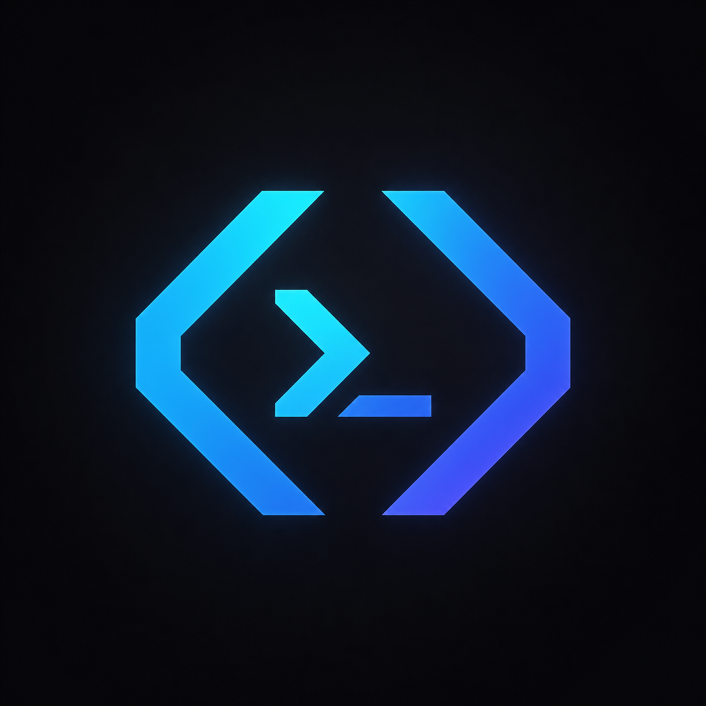
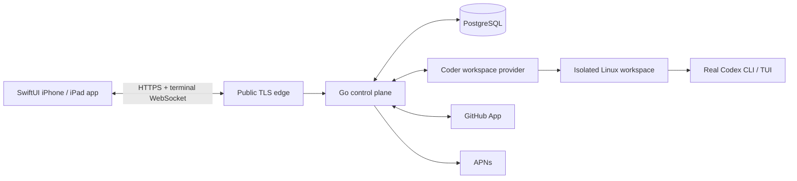

# Codex Mobile

<p align="center">
  
</p>

Codex Mobile is a native iPhone and iPad client for the real Codex CLI running
in persistent, isolated Linux workspaces. It is an independent, single-owner
personal project and is not an official OpenAI product.

The repository contains:

- `apps/ios`: SwiftUI client and generated API client
- `services/control-plane`: Go API, policy engine, terminal gateway, and provider adapters
- `packages/api-contract`: versioned OpenAPI and terminal wire contracts
- `infra`: owner-PC private-beta hosting, deferred single-VPS deployment,
  Coder template, Caddy, and PostgreSQL
- `docs`: architecture decisions, runbooks, research evidence, and verification reports
- `scripts`: local development, policy, generation, and verification entry points

## Current status

This repository contains the end-to-end implementation candidate. Portable
Windows verification covers Go vet, the complete race suite, statement
coverage, deterministic Linux helper cross-builds, infrastructure policy, iOS
static contracts, supply-chain reproducibility, and release-artifact
validation. Public GitHub Actions provide the authoritative Linux and Xcode
26.6 simulator gates without requiring the owner to operate a Mac.

Credentialed scenarios that need the owner's stable HTTPS origin/domain,
GitHub App, Apple account/device, or ChatGPT login remain explicitly gated.
The active private-beta host is the owner's D-backed Ubuntu WSL environment;
no VPS is required or authorized. See
[IMPLEMENTATION_PLAN.md](IMPLEMENTATION_PLAN.md) for milestone status and
[docs/verification/ACCEPTANCE.md](docs/verification/ACCEPTANCE.md) for the exact
evidence boundary.

## Architecture



Repository contents, terminal data, previews, devcontainers, filenames, and
Codex project configuration cross hostile-input boundaries. See
[ARCHITECTURE.md](ARCHITECTURE.md) and [SECURITY.md](SECURITY.md) for the
enforced interfaces and residual risks.

## Local development

Prerequisites are pinned in `.tool-versions`. The backend can be developed on
Windows, macOS, or Linux. Local native-app iteration requires macOS and Xcode,
but every pull request and `main` update is compiled and tested by the hosted
macOS workflow.

```shell
sh ./scripts/dev.sh
# or: pwsh ./scripts/dev.ps1
```

The first invocation starts private PostgreSQL/Coder services and pauses for
Coder's one-time browser owner/token ceremony; rerunning the same command starts
and health-checks the complete local stack. That human ceremony is deliberately
not replaced with an automatically disclosed password. Local values live only
in ignored `.codex-mobile-development.env`, `.data`, and `.secrets` paths.

Run `sh ./scripts/verify.sh` or `pwsh ./scripts/verify.ps1` for all portable checks.
See [operations runbooks](docs/runbooks/README.md) and the tracked
[supply-chain reports](docs/security/SUPPLY_CHAIN.md). The Compose environment
is the basis of the active owner-PC private beta. A fail-closed beta service and
ingress profile still has to be completed before the signed app can use it.
The PC, WSL distribution, services, and reviewed ingress must remain running.
The historical VPS workflow is deferred and never creates a server
automatically.

## CI from a PC

GitHub runs the portable suite on `ubuntu-24.04` and the native simulator suite
on `macos-26` with Xcode 26.6. Both use standard GitHub-hosted runners and
require public visibility plus the `PUBLIC_CI_ENABLED` repository variable.
Neither workflow receives repository secrets or write permission. See
[docs/runbooks/CI.md](docs/runbooks/CI.md).

## Safety invariants

- No OpenAI API-key fallback; Codex uses ChatGPT sign-in/device auth.
- No public Podman socket, Coder admin API, PostgreSQL, SSH, or workspace ports.
  The dedicated root-owned workspace-engine socket is private, restricted to
  the unprivileged provisioner, and treated as root-equivalent authority.
- One user-namespaced, non-privileged workspace per session and one unique task
  branch/worktree. The active local profile must enforce measured fail-closed
  storage bounds; immutable 8–16 GiB XFS project quotas belong to the deferred
  VPS profile.
- Workspace shells, Codex, and helper Git subprocesses inherit only explicit
  environment allowlists plus owner-configured values and active grants.
- No billable resource creation, DNS changes, GitHub App registration, APNs mutation, TestFlight upload, or remote push without explicit owner approval.
- No production secrets in source control.

Read [SECURITY.md](SECURITY.md) before changing authentication, terminal, workspace, file, preview, or infrastructure code.

## Support, contributions, and license

See [SUPPORT.md](SUPPORT.md) for issue-reporting boundaries and
[CONTRIBUTING.md](CONTRIBUTING.md) before proposing a change.

No open-source license is granted. Apart from the limited rights GitHub's Terms
provide for platform features such as viewing and forking, copying,
modification, or redistribution is not authorized. Third-party dependency
licenses remain listed in
[docs/security/LICENSES.md](docs/security/LICENSES.md), and generated media
origin is recorded in [docs/media/PROVENANCE.md](docs/media/PROVENANCE.md).
